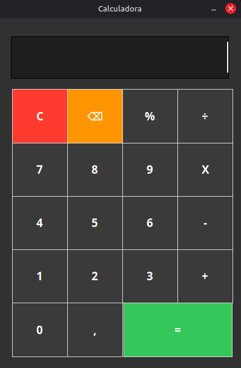

# 🧮 Python Calculator

A simple desktop calculator built using **Python** and **Tkinter**.

This project was created as a practice project to learn GUI development and basic programming logic.

---

## 📸 Preview



---

## 🚀 Features

* Graphical interface with Tkinter
* Basic math operations (+ − × ÷)
* Percentage calculation (%)
* Keyboard input support
* Backspace button (⌫)
* Clear button (C)
* Error handling (invalid operations and division by zero)
* Results rounded to 2 decimal places

---

## 🛠 Technologies

* Python
* Tkinter

---

## ▶ How to Run

Clone the repository:

```bash
git clone https://github.com/HenriqueC-r/python-calculator.git
```

Enter the folder:

```bash
cd python-calculator
```

Run the program:

```bash
python calc.py
```

---

## 📦 Download (Windows)

You can download the executable version from the **Releases** section.

---

## 👨‍💻 Author

**Caio Henrique**

GitHub:
https://github.com/HenriqueC-r

